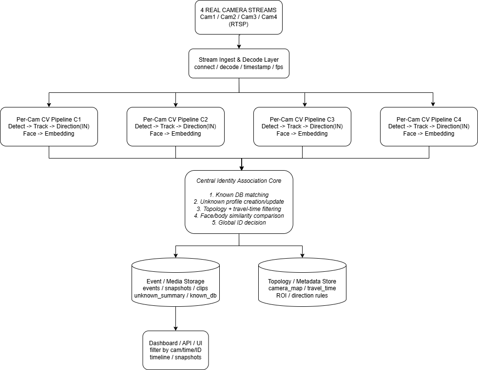
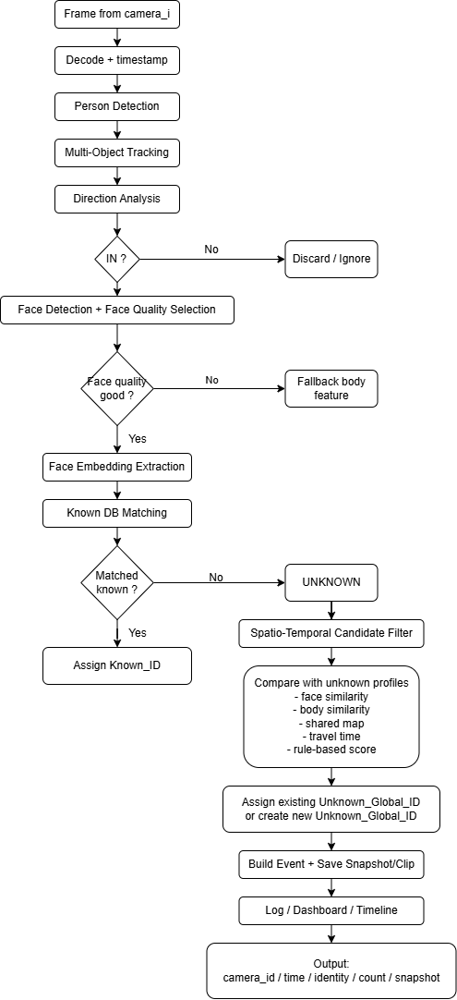

# 🎥 A Multi–Camera System for Detecting and Tracking Strangers Entering a Facility

> **Graduation Project** — Real-time multi-camera security surveillance system that detects, tracks, and manages strangers entering a protected area.

[](https://python.org)
[](https://opencv.org)
[](https://pytorch.org)
[](LICENSE)

---

## 📋 Table of Contents

- [Overview](#-overview)
- [Problem Statement](#-problem-statement)
- [System Architecture](#-system-architecture)
- [Processing Workflow](#-processing-workflow)
- [Key Features](#-key-features)
- [System Inputs](#-system-inputs)
- [System Outputs](#-system-outputs)
- [Challenges](#-challenges)
- [Project Scope](#-project-scope)
- [Tech Stack](#-tech-stack)
- [Installation](#-installation)
- [Usage](#-usage)
- [Project Structure](#-project-structure)
- [Contributing](#-contributing)
- [License](#-license)

---

## 🔍 Overview

This project builds a **real-time multi-camera security surveillance system** designed for facilities such as companies, factories, residential complexes, or smart villages. The system processes **4 camera video streams simultaneously**, detects people entering a protected area, identifies them against a known identity database, and — if unrecognized — assigns and maintains a **Global ID for strangers across all cameras**.

The core contribution of this system is a **cross-camera stranger association mechanism** based on:
- 🗺️ Shared spatial map (camera topology)
- ⏱️ Expected travel time between camera positions
- 🧑 Face & body embedding similarity
- 📊 Rule-based scoring for identity linking

---

## 🎯 Problem Statement

The system aims to build a real-time multi-camera security surveillance system based on four video camera streams, designed to **detect, track, and manage strangers** entering a protected area.

The system only processes subjects with an **inward movement direction**, then extracts facial features to compare against a known identity database. If there is no match, the subject is classified as a **stranger** and assigned a **global identifier** for tracking across multiple cameras.

### The Core Challenge

When cameras process independently, the same stranger can be assigned **multiple different IDs** at different camera locations:

```
Camera 1 → assigns Unknown_001
Camera 2 → assigns Unknown_002  ← Same person, different ID!
```

This leads to **fragmented data**, incorrect appearance counts, and defeats the purpose of security monitoring. Our system solves this through **spatio-temporal constraints and multi-modal similarity matching**.

---

## 🏗️ System Architecture

The overall system architecture consists of three main layers:

1. **Stream Ingest & Decode Layer** — Connects to 4 real RTSP camera streams
2. **Per-Camera CV Pipeline** — Each camera runs: Detect → Track → Direction(IN) → Face → Embedding
3. **Central Identity Association Core** — Known DB matching, unknown profile management, topology + travel-time filtering, face/body similarity, and Global ID decision
4. **Storage & Dashboard** — Event/media storage and topology/metadata store feed into a Dashboard/API/UI

<p align="center">
  
</p>

---

## ⚙️ Processing Workflow

The per-camera processing workflow follows a detailed flowchart with decision branches:

<p align="center">
  
</p>

### Workflow Summary

1. **Frame from camera_i** → Decode + timestamp
2. **Person Detection** → **Multi-Object Tracking** → **Direction Analysis**
3. **IN?** → If No: Discard/Ignore. If Yes: continue
4. **Face Detection + Face Quality Selection**
5. **Face quality good?** → If No: Fallback to body feature. If Yes: Face Embedding Extraction
6. **Known DB Matching** → **Matched known?**
   - ✅ Yes → Assign `Known_ID`
   - ❌ No → **UNKNOWN** → Spatio-Temporal Candidate Filter
7. **Compare with unknown profiles** (face similarity, body similarity, shared map, travel time, rule-based score)
8. **Assign existing `Unknown_Global_ID` or create new `Unknown_Global_ID`**
9. **Build Event + Save Snapshot/Clip** → **Log / Dashboard / Timeline**
10. **Output**: `camera_id / time / identity / count / snapshot`

### Cross-Camera Scoring Formula

```
Score = α × FaceScore + β × BodyScore + γ × TimeScore + δ × CameraTopologyScore
```

If the score exceeds the threshold → **link to existing Global ID**; otherwise → **create new Global ID**.

---

## ✨ Key Features

- 🔴 **Real-time Processing** — Handles 4 simultaneous camera streams
- 🚶 **Direction Filtering** — Only processes people entering the facility
- 🧑‍🤝‍🧑 **Known vs Unknown Classification** — Open-set face recognition against known DB
- 🆔 **Cross-Camera Global ID** — Maintains consistent stranger identity across all cameras
- 🗺️ **Spatial-Temporal Reasoning** — Uses camera topology map and travel time estimates
- 📸 **Multi-Frame Reference** — Stores multiple best-shot frames to reduce recognition errors
- 🧮 **Rule-Based Scoring** — Combines face, body, time, and topology scores for robust matching
- 📊 **Event Dashboard** — Logs and visualizes all security events

---

## 📥 System Inputs

| Input | Description |
|-------|-------------|
| **4 Video Streams** | RTSP/HTTP streams or recorded video from 4 different cameras covering gates, hallways, lobbies, etc. |
| **Known Identity DB** | Database containing `known_id`, face images/embeddings, and basic information |
| **Spatial Map** | Camera topology graph with adjacency relationships and expected travel times (e.g., C1→C2: 6–15s) |

### Example Camera Topology

```
C1 → C2: 6–15 seconds
C1 → C3: 12–25 seconds
C2 → C4: 5–12 seconds
C3 → C4: 4–10 seconds
```

---

## 📤 System Outputs

Each security event contains:

```json
{
    "camera_id": "C2",
    "timestamp": "2026-04-02T13:30:00",
    "direction": "IN",
    "identity": "Unknown_Global_003",
    "identity_type": "stranger",
    "snapshot": "frame_c2_13300.jpg",
    "appearance_count": 3,
    "appearance_history": [
        {"camera": "C1", "time": "13:29:45"},
        {"camera": "C2", "time": "13:29:57"},
        {"camera": "C4", "time": "13:30:10"}
    ]
}
```

### Stranger Global Profile

```json
{
    "unknown_global_id": "UNK_003",
    "first_seen_camera": "C1",
    "first_seen_time": "2026-04-02T13:29:45",
    "last_seen_camera": "C4",
    "last_seen_time": "2026-04-02T13:30:10",
    "best_face_frames": ["frame1.jpg", "frame2.jpg", "frame3.jpg"],
    "best_body_frames": ["body1.jpg", "body2.jpg"],
    "face_embeddings": ["<512-d vector>", "..."],
    "body_embeddings": ["<256-d vector>", "..."],
    "trajectory_history": ["C1 → C2 → C4"],
    "candidate_next_cameras": ["C3"]
}
```

---

## ⚠️ Challenges

| Challenge | Description |
|-----------|-------------|
| **Poor Face Visibility** | Subjects may turn away, wear masks, be far from camera, or be affected by motion blur |
| **Cross-Camera Appearance Variation** | Same person looks different across cameras due to varying angles, lighting, and distances |
| **Open-Set Recognition** | The system must correctly reject unknown faces rather than force-matching to a known identity |
| **ID Fragmentation vs. Merging** | One person may get multiple Global IDs (fragmentation) or two different people may be merged into one ID |

---

## 📦 Project Scope

### ✅ In Scope
- 4 real camera video streams processing
- Person detection + multi-object tracking + direction filtering
- Face embedding extraction + known DB matching
- Unknown global ID management
- Shared spatial map + travel time constraints
- Rule-based cross-camera association
- Logging + simple dashboard

### ❌ Out of Scope
- Training face recognition models from scratch
- Distributed infrastructure deployment
- Commercial-grade CCTV system

---

## 🛠️ Tech Stack

| Component | Technology |
|-----------|-----------|
| **Language** | Python 3.10+ |
| **Person Detection** | YOLOv8 / YOLOv9 |
| **Object Tracking** | ByteTrack / DeepSORT |
| **Face Detection** | RetinaFace / MTCNN |
| **Face Recognition** | ArcFace (InsightFace) |
| **Body Re-ID** | OSNet / ResNet-based Re-ID |
| **Video Processing** | OpenCV |
| **Deep Learning** | PyTorch |
| **Dashboard** | Streamlit / Flask |
| **Database** | SQLite / PostgreSQL |

---

## 🚀 Installation

### Prerequisites

- Python 3.10 or higher
- CUDA-capable GPU (recommended)
- 4 camera streams (RTSP/HTTP) or recorded video files

### Setup

```bash
# Clone the repository
git clone https://github.com/TTungMaverix/A-Multi-Camera-System-for-Detecting-and-Tracking-Strangers-Entering-a-Facility.git
cd A-Multi-Camera-System-for-Detecting-and-Tracking-Strangers-Entering-a-Facility

# Create virtual environment
python -m venv venv
source venv/bin/activate  # Linux/Mac
venv\Scripts\activate     # Windows

# Install dependencies
pip install -r requirements.txt

# Download pretrained models
python scripts/download_models.py
```

---

## 💻 Usage

### Configuration

Edit `config/settings.yaml` to configure:

```yaml
cameras:
  - id: C1
    source: "rtsp://192.168.1.101:554/stream"
    location: "Main Gate"
  - id: C2
    source: "rtsp://192.168.1.102:554/stream"
    location: "Lobby"
  - id: C3
    source: "rtsp://192.168.1.103:554/stream"
    location: "Hallway"
  - id: C4
    source: "rtsp://192.168.1.104:554/stream"
    location: "Inner Area"

camera_topology:
  C1-C2: {min_time: 6, max_time: 15}
  C1-C3: {min_time: 12, max_time: 25}
  C2-C4: {min_time: 5, max_time: 12}
  C3-C4: {min_time: 4, max_time: 10}

thresholds:
  face_similarity: 0.6
  body_similarity: 0.5
  cross_camera_score: 0.7
```

### Run the system

```bash
# Start the multi-camera surveillance system
python main.py --config config/settings.yaml

# Start the dashboard
python dashboard.py
```

---

## 📁 Project Structure

```
multi-camera-stranger-detection/
├── config/
│   ├── settings.yaml          # System configuration
│   └── camera_topology.json   # Camera spatial map
├── src/
│   ├── stream/
│   │   └── stream_manager.py  # Multi-stream video handler
│   ├── detection/
│   │   └── person_detector.py # Person detection module
│   ├── tracking/
│   │   └── tracker.py         # Multi-object tracking
│   ├── direction/
│   │   └── direction_filter.py # Entry direction analysis
│   ├── face/
│   │   ├── face_detector.py   # Face detection
│   │   ├── face_quality.py    # Face quality assessment
│   │   └── face_embedder.py   # Face embedding extraction
│   ├── identity/
│   │   ├── known_matcher.py   # Known DB matching
│   │   └── stranger_manager.py # Unknown global ID mgmt
│   ├── association/
│   │   ├── spatial_map.py     # Camera topology map
│   │   ├── travel_time.py     # Travel time estimation
│   │   └── cross_camera.py    # Cross-camera association
│   └── logging/
│       └── event_logger.py    # Security event logging
├── data/
│   ├── known_db/              # Known identity database
│   └── spatial_map/           # Camera topology data
├── models/                    # Pretrained model weights
├── dashboard/                 # Web dashboard
├── scripts/
│   └── download_models.py     # Model downloader
├── tests/                     # Unit and integration tests
├── main.py                    # Main entry point
├── requirements.txt           # Python dependencies
├── .gitignore                 # Git ignore rules
├── LICENSE                    # MIT License
└── README.md                  # This file
```

---

## 🤝 Contributing

Contributions are welcome! Please feel free to submit a Pull Request.

1. Fork the repository
2. Create your feature branch (`git checkout -b feature/amazing-feature`)
3. Commit your changes (`git commit -m 'Add amazing feature'`)
4. Push to the branch (`git push origin feature/amazing-feature`)
5. Open a Pull Request

---

## 📄 License

This project is licensed under the MIT License — see the [LICENSE](LICENSE) file for details.

---

## 📫 Contact

For questions or collaboration, please open an issue on this repository.

---

<p align="center">
  <i>Built with ❤️ as a Graduation Project</i>
</p>
